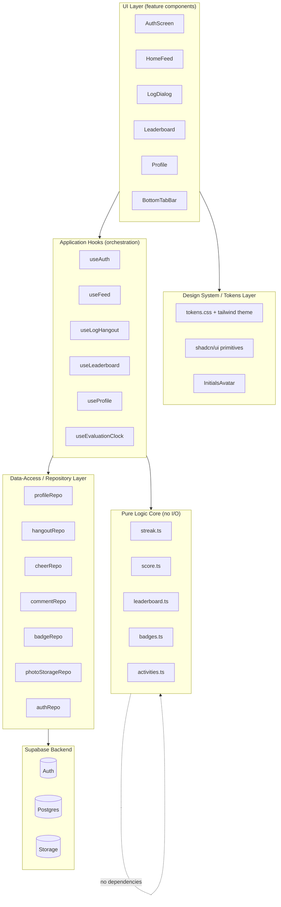
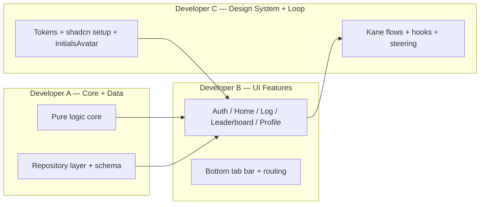
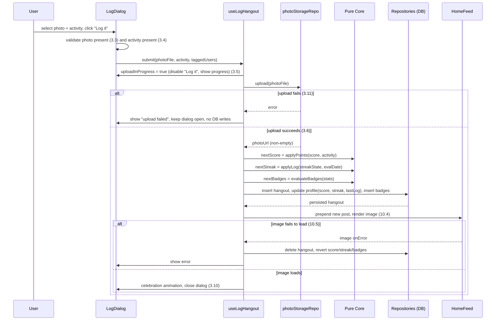
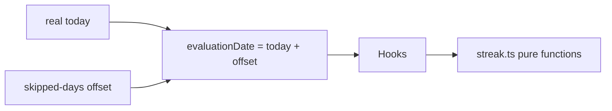
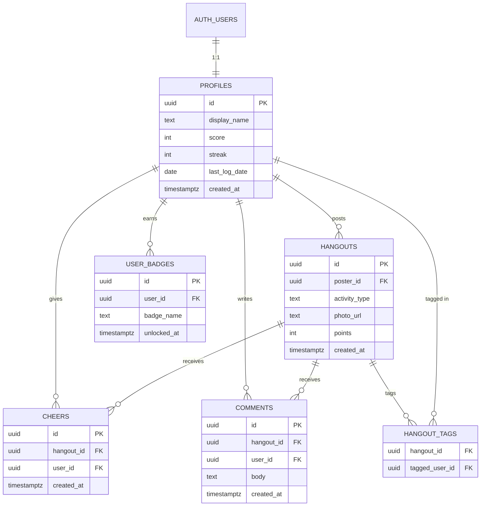

# Design Document

## Overview

TouchGrass is a mobile-first web app that gamifies real-world socializing. Users sign up, log in-person hangouts with a required photo, earn points from a fixed activity list, maintain a daily streak, unlock milestone badges, and compete on a leaderboard. Logging is honor-system — the app never verifies that a user actually went outside — and the app starts with no seed data, filling only with real persisted records.

This design translates the twelve requirements into an implementable architecture. It is shaped by three goals that come directly from the project context:

1. **Deterministic core, isolated from I/O.** The streak engine, scoring, leaderboard ordering, and badge-unlock rules are pure functions with no knowledge of React, Supabase, or the network. This satisfies Requirement 10's determinism mandate (same actions on same state produce the same result) and makes the rules cheap to unit-test and property-test without a browser or a database.
2. **Stable, testable UI contracts.** Every label and `data-testid` named in Requirement 10 is treated as a public contract that a browser agent (Kane CLI) drives and asserts against. Labels and test IDs are centralized so they cannot drift.
3. **Modular boundaries for parallel work.** The codebase is split into five layers with narrow interfaces — auth, data-access (repository), pure-logic core, UI feature components, and the design-system/token layer — so three developers can work concurrently with minimal merge conflicts.

The stack is React + Vite + TypeScript, Tailwind CSS + shadcn/ui, lucide-react icons, and Supabase for authentication, Postgres, and photo storage. The frontend is served at `http://localhost:3000` (Requirement 11).

### Design Principles

| Principle | Rationale | Requirements |
|---|---|---|
| Pure logic core has zero dependencies on React/Supabase | Deterministic, fast to test, parallel-friendly | 7, 5, 6, 10.7 |
| Repository layer is the only code that talks to Supabase | UI and logic never import the Supabase client directly; swappable and mockable | 1, 3, 4, 12 |
| Labels and test IDs live in one constants module | A single source of truth that Kane flows and components share | 10.1, 10.3 |
| Tokens-only styling (no arbitrary hex/px) | Premium consistency, enforced by lint | 9.1, 9.2 |
| Score/streak/badges are derived then persisted | The DB stores results; the pure core computes them so they are reproducible | 3.8, 3.9, 6, 7 |

## Architecture

### Layered Architecture

The app is organized into five layers with a strict dependency direction: UI depends on hooks, hooks depend on the repository and the pure core, and nothing depends on the UI. The pure core depends on nothing.



### Module Ownership for Parallel Development

The layer boundaries double as work-split boundaries. Each owner codes against the interfaces defined in this document, so integration is a matter of matching signatures rather than reconciling internals.



Contracts that keep these independent:
- **Core interfaces** (pure function signatures) are frozen first, so UI and tests can be built against them while implementations land.
- **Repository interfaces** are defined as TypeScript interfaces with an in-memory fake implementation, so UI work and property tests do not block on a live Supabase project.
- **`labels.ts` and `testids.ts`** are owned jointly but rarely change; Kane flows and components both import from them.

### Hangout Logging Flow

The most complex orchestration is logging a hangout, because it touches storage, the database, the pure core (score + streak + badges), and includes a rollback path required by Requirement 10.5.



### Streak Evaluation Clock

Requirement 8 introduces a `Skip_A_Day_Control` that advances the `Streak_Evaluation_Date`. To keep the core pure, the "current evaluation date" is never read from `Date.now()` inside the logic. Instead a small clock module holds an offset (number of skipped days) and produces the evaluation date, which is passed into the pure functions.



This makes streak behavior fully reproducible: tests pass an explicit date and never depend on the wall clock, satisfying Requirement 10.7.

## Components and Interfaces

### Pure Logic Core (`src/core/`)

These modules are pure TypeScript with no imports from React or Supabase. They are the heart of the determinism and testability requirements.

#### `activities.ts`

```typescript
export type ActivityType = "Coffee" | "Gym" | "Dinner" | "Hike";

// Fixed point values (Glossary, Requirement 3.2)
export const ACTIVITY_POINTS: Record<ActivityType, number> = {
  Coffee: 10,
  Gym: 20,
  Dinner: 30,
  Hike: 50,
};

export const ACTIVITY_EMOJI: Record<ActivityType, string> = {
  Coffee: "☕",
  Gym: "💪",
  Dinner: "🍽️",
  Hike: "🥾",
};

export const ACTIVITIES: readonly ActivityType[] =
  ["Coffee", "Gym", "Dinner", "Hike"] as const;

export function pointsFor(activity: ActivityType): number;
export function isActivityType(value: string): value is ActivityType;
```

#### `score.ts`

```typescript
// Requirement 3.8 — add the activity's points to the current score.
export function applyPoints(currentScore: number, activity: ActivityType): number;
```

#### `streak.ts`

The streak engine is a state transition over a `StreakState`. It is date-driven, not clock-driven, so it is deterministic (Requirement 7, 8, 10.7).

```typescript
export interface StreakState {
  streak: number;            // non-negative integer
  lastLogDate: string | null; // ISO calendar date "YYYY-MM-DD" or null if never logged
}

// Difference in whole calendar days between two ISO dates (b - a).
export function dayDiff(a: string, b: string): number;

// Requirement 7.1, 7.2, 7.3, 7.4, 7.5 — applied when a hangout is logged.
export function applyLog(state: StreakState, evalDate: string): StreakState;

// Requirement 7.6 and 8.3 — applied when the evaluation date advances
// WITHOUT a new log (e.g. "Skip a day").
export function reevaluate(state: StreakState, evalDate: string): StreakState;
```

Transition rules (single source of truth for Requirement 7):

| Condition (`applyLog`) | Result | Validates |
|---|---|---|
| `lastLogDate` is null | `streak = 1`, `lastLogDate = evalDate` | 7.2 |
| `dayDiff(lastLogDate, evalDate) === 0` | `streak` unchanged, `lastLogDate = evalDate` | 7.3 |
| `dayDiff(lastLogDate, evalDate) === 1` | `streak += 1`, `lastLogDate = evalDate` | 7.1 |
| `dayDiff(lastLogDate, evalDate) >= 2` | `streak = 1`, `lastLogDate = evalDate` | 7.4 |

| Condition (`reevaluate`) | Result | Validates |
|---|---|---|
| `lastLogDate` is null | `streak = 0` | 8.3 |
| `dayDiff(lastLogDate, evalDate) >= 2` | `streak = 0` | 7.6 |
| otherwise | unchanged | 7.x |

`applyLog` always sets `lastLogDate` to `evalDate` (Requirement 7.5).

#### `badges.ts`

```typescript
export type BadgeName = "First Steps" | "Weekend Warrior" | "On Fire";

export interface BadgeStats {
  hangoutCount: number; // total logged hangouts for the user
  streak: number;       // current streak
}

// Returns the full set of badge names that should be unlocked for these stats.
// Pure and monotonic: unlocking is based only on thresholds reached.
export function unlockedBadges(stats: BadgeStats): Set<BadgeName>;

// Badges newly earned given previously-unlocked badges (for "what to persist/animate").
export function newlyUnlocked(
  prev: ReadonlySet<BadgeName>,
  stats: BadgeStats,
): Set<BadgeName>;
```

Thresholds (Requirement 6): `First Steps` at `hangoutCount >= 1` (6.4); `Weekend Warrior` at `hangoutCount >= 5` (6.5, 6.6); `On Fire` at `streak >= 7` (6.7).

#### `leaderboard.ts`

```typescript
export interface LeaderboardEntry {
  userId: string;
  displayName: string;
  score: number;
  streak: number;
}

// Requirement 5.1, 5.2, 5.3, 5.6 — total ordering.
// Sort by score desc, then streak desc, then displayName asc (case-insensitive,
// locale-aware), with userId as a final stable tiebreak for total determinism.
export function rankUsers(entries: LeaderboardEntry[]): LeaderboardEntry[];
```

### Data-Access / Repository Layer (`src/data/`)

Repositories are the only modules that import the Supabase client. Each is defined as an interface plus a Supabase-backed implementation plus an in-memory fake used in tests and for parallel UI development.

```typescript
export interface ProfileRepo {
  create(userId: string, displayName: string): Promise<Profile>; // 1.3
  getById(userId: string): Promise<Profile | null>;
  list(): Promise<Profile[]>;                                    // leaderboard source (5.1)
  update(userId: string, patch: Partial<Profile>): Promise<Profile>; // score/streak/badges
}

export interface HangoutRepo {
  create(input: NewHangout): Promise<Hangout>;   // 3.7
  delete(hangoutId: string): Promise<void>;       // rollback (10.5)
  listFeed(): Promise<HangoutWithPoster[]>;       // 4.1, newest first
  listByUser(userId: string): Promise<Hangout[]>; // 6.3
  countByUser(userId: string): Promise<number>;   // badge thresholds (6.4-6.6)
}

export interface CheerRepo {
  add(hangoutId: string, userId: string): Promise<void>; // 4.5
  countFor(hangoutId: string): Promise<number>;          // 4.4
}

export interface CommentRepo {
  add(hangoutId: string, userId: string, body: string): Promise<void>;
  countFor(hangoutId: string): Promise<number>;          // 4.4
}

export interface BadgeRepo {
  listByUser(userId: string): Promise<BadgeName[]>;       // 6.2
  unlock(userId: string, badge: BadgeName): Promise<void>; // 6.4-6.7
}

export interface PhotoStorageRepo {
  upload(file: File, userId: string): Promise<string>;   // 3.6 returns non-empty URL
}

export interface AuthRepo {
  signUp(email: string, password: string): Promise<AuthUser>; // 1.2
  signIn(email: string, password: string): Promise<AuthUser>; // 2.1
  signOut(): Promise<void>;                                    // 2.6
  getSession(): Promise<AuthSession | null>;                   // 2.7, 2.8
  onAuthStateChange(cb: (s: AuthSession | null) => void): Unsubscribe;
}
```

A single `createHangoutWithSideEffects` use-case function composes these to implement the Requirement 3 flow (upload → compute → persist → rollback), keeping the orchestration testable in isolation from React.

### Application Hooks (`src/hooks/`)

Hooks adapt the repositories and pure core to React. They hold no business rules themselves — they call the core for any computation.

- `useAuth()` — session state, sign up, log in, log out (Req 1, 2). Exposes `status: "loading" | "authed" | "anon"` to drive routing (2.7, 2.8).
- `useEvaluationClock()` — owns the skipped-days offset and exposes `evaluationDate` and `skipADay()` (Req 8). On skip, calls `streak.reevaluate` and persists.
- `useFeed()` — loads the feed newest-first, exposes cheer/comment counts and `cheer(hangoutId)` (Req 4).
- `useLogHangout()` — drives the logging flow including upload progress, validation, and rollback (Req 3, 10.5).
- `useLeaderboard()` — loads profiles and returns `rankUsers(...)` output, with current-user highlight flag (Req 5).
- `useProfile()` — current user stats, badges, and own-hangout grid (Req 6).

### UI Feature Components (`src/features/`)

Each feature is a self-contained folder. Components consume hooks and the design system only.

| Component | Requirements | Key labels / test IDs |
|---|---|---|
| `AuthScreen` | 1, 2 | labels `Sign up`, `Log in`, `Log out`; field validation messages |
| `BottomTabBar` | 3.1, 9.3 | Home/Log/Leaderboard/Profile tabs; center Log control opens `Log_Dialog` |
| `HomeFeed` + `FeedPost` | 4, 10.3, 10.4 | `data-testid` `feed-post`, `feed-post-image`, `streak-counter`; label `Cheer` |
| `LogDialog` | 3, 10.2 | file input, activity list, tag control, label `Log it` |
| `Leaderboard` + `LeaderboardRow` | 5, 10.3 | `data-testid` `leaderboard-row-{displayName}`, `score-display` |
| `Profile` + `BadgeItem` | 6, 10.3 | `data-testid` `badge-{name}`, `score-display`, `streak-counter` |
| `Celebration` | 3.10 | celebration animation overlay |
| `SkipADayButton` | 8 | label `Skip a day` |
| `ConfigError` | 11.4 | missing-config error screen |

### Design System / Tokens Layer (`src/design-system/`)

This layer owns all visual primitives and is independent of features (Req 9).

- `tokens.css` — CSS variables for the color palette, the spacing scale (4, 8, 12, 16, 24, 32 px), and Inter typography (9.1). The grass-green accent is `--color-accent: #22C55E` (9.4).
- `tailwind.config.ts` — maps tokens into the Tailwind theme so components reference `bg-accent`, `p-2`, etc., never raw hex or px (9.2).
- shadcn/ui primitives — `Button`, `Card`, `Tabs`, `Dialog`, `Avatar`, `Badge`, `Input` (9.5).
- `InitialsAvatar` — renders a colored circle with the user's initials (9.6), color derived deterministically from the display name.
- `AppShell` — centers a phone-width column at `max-width: 430px` with a fixed bottom bar (9.3).
- Global `transition` utility applied to interactive controls (9.7).

### Shared Contracts (`src/contracts/`)

```typescript
// labels.ts — the exact strings from Requirement 10.1
export const LABELS = {
  signUp: "Sign up",
  logIn: "Log in",
  logIt: "Log it",
  cheer: "Cheer",
  skipADay: "Skip a day",
  logOut: "Log out",
} as const;

// testids.ts — the attributes from Requirement 10.3
export const TESTIDS = {
  streakCounter: "streak-counter",
  scoreDisplay: "score-display",
  feedPost: "feed-post",
  feedPostImage: "feed-post-image",
  leaderboardRow: (displayName: string) => `leaderboard-row-${displayName}`,
  badge: (name: string) => `badge-${name}`,
} as const;

// copy.ts — fixed on-screen strings asserted by Kane
export const COPY = {
  noGrassToday: "You haven't touched grass today.",
  emptyFeed: "No grass touched yet — be the first",
} as const;
```

Centralizing these is what lets Kane flows and components stay in lockstep (Req 10) and prevents merge drift across the three developers.

## Data Models

### Postgres Schema (Supabase)

All tables live in the `public` schema with Row Level Security (RLS) enabled. `profiles.id` is the foreign key to `auth.users.id`. No seed regular users, hangouts, or comments are inserted (Requirement 12.3).



#### Table definitions

```sql
-- profiles: one row per registered user (Requirement 1.3, 12.1)
create table public.profiles (
  id            uuid primary key references auth.users(id) on delete cascade,
  display_name  text not null check (char_length(display_name) between 1 and 50),
  score         int  not null default 0 check (score >= 0),
  streak        int  not null default 0 check (streak >= 0),
  last_log_date date,
  created_at    timestamptz not null default now()
);

-- hangouts: one row per logged activity (Requirement 3.7, 12.1)
create table public.hangouts (
  id            uuid primary key default gen_random_uuid(),
  poster_id     uuid not null references public.profiles(id) on delete cascade,
  activity_type text not null check (activity_type in ('Coffee','Gym','Dinner','Hike')),
  photo_url     text not null check (char_length(photo_url) > 0),
  points        int  not null check (points >= 0),
  created_at    timestamptz not null default now()
);

-- hangout_tags: optional tagged users (Requirement 3.2, 3.7)
create table public.hangout_tags (
  hangout_id      uuid not null references public.hangouts(id) on delete cascade,
  tagged_user_id  uuid not null references public.profiles(id) on delete cascade,
  primary key (hangout_id, tagged_user_id)
);

-- cheers: reactions counted per hangout (Requirement 4.4, 4.5, 12.1)
create table public.cheers (
  id          uuid primary key default gen_random_uuid(),
  hangout_id  uuid not null references public.hangouts(id) on delete cascade,
  user_id     uuid not null references public.profiles(id) on delete cascade,
  created_at  timestamptz not null default now(),
  unique (hangout_id, user_id) -- one cheer per user per hangout
);

-- comments: text responses counted per hangout (Requirement 4.4, 12.1)
create table public.comments (
  id          uuid primary key default gen_random_uuid(),
  hangout_id  uuid not null references public.hangouts(id) on delete cascade,
  user_id     uuid not null references public.profiles(id) on delete cascade,
  body        text not null check (char_length(body) > 0),
  created_at  timestamptz not null default now()
);

-- user_badges: unlocked milestone awards (Requirement 6.2, 6.4-6.7)
create table public.user_badges (
  id           uuid primary key default gen_random_uuid(),
  user_id      uuid not null references public.profiles(id) on delete cascade,
  badge_name   text not null check (badge_name in ('First Steps','Weekend Warrior','On Fire')),
  unlocked_at  timestamptz not null default now(),
  unique (user_id, badge_name) -- a badge unlocks at most once per user
);
```

#### Indexes

- `hangouts (created_at desc)` — feed ordering (4.1).
- `hangouts (poster_id, created_at desc)` — profile grid (6.3) and per-user count (6.4–6.6).
- `cheers (hangout_id)`, `comments (hangout_id)` — counts (4.4).
- `profiles (score desc, streak desc, display_name asc)` — supports leaderboard reads (5).

#### Row Level Security (summary)

- `profiles`: readable by any authenticated user (leaderboard/feed need display names); writable only by the owner (`id = auth.uid()`).
- `hangouts`, `cheers`, `comments`: readable by any authenticated user; insert restricted to `auth.uid() = poster_id/user_id`; delete restricted to the owner (supports rollback, 10.5).
- `user_badges`: readable by any authenticated user; insert/select restricted to the owner.

The leaderboard's final ordering is enforced in the pure core (`rankUsers`) rather than relying on SQL ordering, so the ordering is identical whether or not the Leaderboard tab is displayed (Requirement 5.3) and is unit/property-testable.

### Storage Buckets (Supabase Storage)

```
bucket: hangout-photos   (public read)
  path:  {userId}/{hangoutId or uuid}.{ext}
```

- Public-read so feed `` sources resolve to a non-empty URL (3.6, 4.3, 10.4).
- Insert policy restricts uploads to the authenticated user's own folder (`{auth.uid()}/...`).
- The repository returns the public URL string; an empty/failed upload is treated as an error (3.11).

### TypeScript Domain Types (`src/data/types.ts`)

```typescript
export interface Profile {
  id: string;
  displayName: string;
  score: number;
  streak: number;
  lastLogDate: string | null; // "YYYY-MM-DD"
  createdAt: string;
}

export interface Hangout {
  id: string;
  posterId: string;
  activityType: ActivityType;
  photoUrl: string;
  points: number;
  taggedUserIds: string[];
  createdAt: string;
}

export interface HangoutWithPoster extends Hangout {
  posterDisplayName: string;
  cheerCount: number;
  commentCount: number;
}

export interface NewHangout {
  posterId: string;
  activityType: ActivityType;
  photoUrl: string;
  points: number;
  taggedUserIds: string[];
}
```

### Configuration

`.env` (Requirement 11.2, 11.3):

```
VITE_SUPABASE_URL=...
VITE_SUPABASE_ANON_KEY=...
```

At startup a config guard reads these values; if either is missing it renders `ConfigError` naming the missing variable (11.4). Vite dev server is configured to serve on port 3000 (11.1).

## Correctness Properties

*A property is a characteristic or behavior that should hold true across all valid executions of a system — essentially, a formal statement about what the system should do. Properties serve as the bridge between human-readable specifications and machine-verifiable correctness guarantees.*

The properties below were derived from the acceptance-criteria prework. Redundant criteria were consolidated: all streak-on-log rules collapse into one transition property, all leaderboard ordering rules into one total-order property, all badge thresholds into one property, and all sign-up validation rules into one validation property. Each property is implemented by a single property-based test (minimum 100 iterations).

### Property 1: Streak transition on log

*For any* `StreakState` and any evaluation date, `applyLog(state, evalDate)` sets `lastLogDate` to `evalDate` and produces a streak that is: `1` when there was no prior last-log date; the previous streak unchanged when the last-log date equals `evalDate`; the previous streak plus one when `evalDate` is exactly one calendar day after the last-log date; and `1` when `evalDate` is two or more calendar days after the last-log date.

**Validates: Requirements 7.1, 7.2, 7.3, 7.4, 7.5, 3.9**

### Property 2: Streak reevaluation on date advance

*For any* `StreakState` and any evaluation date, `reevaluate(state, evalDate)` produces a streak of `0` when there is no last-log date or when `evalDate` is two or more calendar days after the last-log date, and leaves the streak unchanged otherwise.

**Validates: Requirements 7.6, 8.3**

### Property 3: Leaderboard total ordering

*For any* list of users, `rankUsers` returns a permutation of the input ordered by score descending, then by streak descending, then by display name ascending (case-insensitive), with no remaining ambiguity — and the same input always yields the same order regardless of whether the Leaderboard tab is displayed.

**Validates: Requirements 5.1, 5.2, 5.3, 5.6**

### Property 4: Badge unlock thresholds

*For any* `BadgeStats`, `unlockedBadges` contains "First Steps" exactly when `hangoutCount >= 1`, "Weekend Warrior" exactly when `hangoutCount >= 5`, and "On Fire" exactly when `streak >= 7`, and contains no other badges.

**Validates: Requirements 6.4, 6.5, 6.6, 6.7**

### Property 5: Sign-up validation

*For any* sign-up input (email, password, display name), validation succeeds if and only if the email is in valid email-address format, the password has at least 8 characters, and the display name has length 1 to 50; whenever it fails, the reported message identifies a specific offending field (missing, invalid email format, or length violation).

**Validates: Requirements 1.2, 1.5, 1.7, 1.8**

### Property 6: Login empty-field validation

*For any* login input, when the email field or the password field is empty, validation fails and identifies the empty field as required, and no authenticated session is attempted.

**Validates: Requirements 2.4**

### Property 7: Scoring is additive by activity

*For any* current score and any `ActivityType`, `applyPoints(score, activity)` equals `score + pointsFor(activity)`, using the fixed values Coffee=10, Gym=20, Dinner=30, Hike=50.

**Validates: Requirements 3.8**

### Property 8: Hangout record construction

*For any* poster, activity type, non-empty photo URL, and set of tagged users, the constructed `Hangout` preserves the poster, activity type, photo URL, and tagged users exactly, and sets `points` equal to `pointsFor(activity)`.

**Validates: Requirements 3.7**

### Property 9: Skip-a-day advances exactly one calendar day

*For any* evaluation date, applying "Skip a day" produces an evaluation date exactly one calendar day later.

**Validates: Requirements 8.2**

### Property 10: "Haven't touched grass today" banner condition

*For any* profile state and evaluation date, the "You haven't touched grass today." banner is shown if and only if the profile's last-log date is not equal to the current evaluation date.

**Validates: Requirements 4.7**

### Property 11: Hangouts render newest-first and complete

*For any* set of hangouts, the feed (all hangouts) and the profile grid (a single user's hangouts) each render exactly the applicable hangouts, ordered by creation timestamp from newest to oldest.

**Validates: Requirements 4.1, 4.9, 6.3**

### Property 12: Feed post content

*For any* hangout, its rendered feed post contains the poster's display name, the activity emoji, the tagged users, the points earned, a relative time-ago label, the "Cheer" label, the cheer count, and the comment count.

**Validates: Requirements 4.2, 4.4, 10.6**

### Property 13: Post image source equals stored photo URL

*For any* created hangout, its rendered feed post contains an image element whose source attribute is non-empty and equal to the hangout's stored photo URL.

**Validates: Requirements 4.3, 10.4**

### Property 14: Leaderboard row content and single highlight

*For any* ranked list of users that includes the current user, each rendered row shows its rank, avatar, display name, score, and streak, and exactly one row — the current user's — is highlighted.

**Validates: Requirements 5.4, 5.5**

### Property 15: Profile content

*For any* profile, the Profile tab renders the avatar, display name, streak, and total score, and renders each unlocked badge by name.

**Validates: Requirements 6.1, 6.2**

### Property 16: Initial profile invariant

*For any* valid display name, a newly created profile has a score of 0, a streak of 0, and zero unlocked badges.

**Validates: Requirements 1.3**

### Property 17: Cheer count increments once per user

*For any* hangout and user, after that user cheers, the hangout's cheer count is exactly one greater than before; cheering again as the same user does not increase the count further.

**Validates: Requirements 4.5**

### Property 18: Initials avatar derivation

*For any* display name, the rendered avatar shows initials derived from that name and a color that is deterministic for that name (the same name always yields the same color).

**Validates: Requirements 9.6**

### Property 19: Safe rollback on failure

*For any* starting persisted state, if the photo upload fails or the new post image fails to load after creation, the final state — total hangout count, score, and streak — equals the starting state, and an error is reported.

**Validates: Requirements 3.11, 10.5**

### Property 20: Determinism of derived results

*For any* starting persisted state and any sequence of logging/skip actions, applying that identical sequence to two identical starting states yields identical derived results (score, streak, leaderboard order, and unlocked badges).

**Validates: Requirements 10.7**

### Property 21: Log dialog submit validation

*For any* Log_Dialog form state, submitting "Log it" creates a hangout only when both a photo and an activity are present; when the photo is missing it reports "photo required", when the activity is missing it reports "activity required", and in either case no hangout is created.

**Validates: Requirements 3.3, 3.4**

## Error Handling

Errors are handled at the layer closest to their source and surfaced to the user with the stable copy the requirements define. The pure core never throws for ordinary inputs; it is total over its domain.

| Scenario | Layer | Behavior | Requirements |
|---|---|---|---|
| Duplicate email on sign up | AuthRepo → useAuth | Show "email already registered"; existing account untouched | 1.4 |
| Invalid field on sign up (format/length/empty) | Validation (pure) | Block submit; message names the field | 1.5, 1.7, 1.8 |
| Auth or DB failure during sign up | useAuth use-case | No session; remove any partially-created profile so no orphan remains | 1.9 |
| Invalid login credentials | AuthRepo → useAuth | Show "credentials invalid"; stay on auth screen | 2.3 |
| Empty login field | Validation (pure) | Show required-field error; no session attempt | 2.4 |
| Missing photo / activity on "Log it" | LogDialog validation | Show specific message; create nothing | 3.3, 3.4 |
| Photo upload failure | useLogHangout | Show "upload failed"; no hangout, no score change; dialog stays open | 3.11 |
| New post image fails to load | useLogHangout | Roll back hangout + revert score/streak/badge changes | 10.5 |
| Missing Supabase config at startup | Config guard | Render `ConfigError` naming the missing variable | 11.4 |

**Atomicity strategy.** Logging a hangout performs writes in an order that makes rollback possible: upload photo first (no DB state yet), then create the hangout row, then update the profile (score/streak) and insert badges. If image verification fails (10.5), the use-case deletes the hangout row and restores the profile's previous score, streak, and badge set captured before the write. Because the new score/streak are computed by the pure core from the pre-state, the pre-state values are always available to restore.

**Honor system.** No error path attempts to verify real-world activity; submission is accepted on the user's word once a photo and activity are present (Introduction, Requirement 3).

## Testing Strategy

The strategy is a testing pyramid that matches the project's cost discipline: cheap deterministic checks run constantly, and the browser agent (Kane CLI) is reserved for complete user-facing flows.

### Layer 1 — Static checks (every save)
TypeScript (`tsc`), ESLint including a rule that forbids arbitrary hex colors and arbitrary pixel values in components (enforces 9.2), and Prettier. Fast and free.

### Layer 2 — Unit tests (example-based)
For the specific scenarios and edge cases classified as EXAMPLE/SMOKE in the prework: auth screen control presence (1.1, 2.5, 8.1), dialog structure (3.2), empty-state copy (4.8), config error naming (11.4), token/theme definitions (9.1, 9.4), and routing reactions (2.2, 2.8). These use Vitest + React Testing Library. Kept deliberately few — properties cover the input space.

### Layer 3 — Property-based tests
Library: **fast-check** with Vitest (do not hand-roll generators or shrinking). Every property in the Correctness Properties section is implemented by exactly one property-based test, configured for a **minimum of 100 iterations** (`{ numRuns: 100 }`).

Each test is tagged with a comment referencing its design property in the format:

```
// Feature: touchgrass, Property 1: Streak transition on log
```

Generators:
- `arbStreakState` — `{ streak: nat, lastLogDate: ISO date | null }`.
- `arbIsoDate` / `arbDatePair` — calendar dates including same-day, +1, and +2-or-more gaps (covers edge cases 7.1–7.6, 8.2).
- `arbUserList` — users with overlapping scores and streaks and Unicode display names to exercise all leaderboard tiebreaks (5.1–5.3).
- `arbBadgeStats` — counts and streaks spanning the thresholds 1, 5, 7 and their boundaries (6.4–6.7).
- `arbSignUpInput` — emails (valid and malformed), passwords (lengths around 8), names (lengths around 1 and 50) (1.2, 1.5, 1.7, 1.8).
- `arbHangout` / `arbHangoutSet` — hangouts with varied activities, photo URLs, tagged users, timestamps (3.7, 4.x, 6.3, 10.4).

Rendering properties (P11–P15) use React Testing Library to render the component from generated data and assert on labels, text, and the `data-testid` attributes from the shared `testids.ts` contract. Use-case properties (P17, P19, P20) run against the **in-memory fake repositories**, so they execute 100+ iterations cheaply with no network.

### Layer 4 — Integration tests (1–3 examples)
For criteria classified INTEGRATION (external Supabase behavior): account creation (1.2 side, 1.4, 1.6), session establishment/restoration/logout (2.1, 2.3, 2.6, 2.7), photo upload returning a URL (3.6), and persistence/sourcing (12.1, 12.2, 12.4). These run against a Supabase test project with 1–3 representative cases each, not in a property loop.

### Layer 5 — Kane CLI browser flows (top of the pyramid)

Kane verifies the rendered, interactive journeys — the assertions only a real browser can make — and only when a complete user-facing behavior changes. Flows are authored as committable `testmd` Markdown so later runs replay from cache (fast, deterministic, no AI cost). Each flow maps to a requirement, and a `postTaskExecution` hook can run the flow for the task that just completed.

| Kane flow (`flows/*.md`) | Drives | Asserts | Requirements |
|---|---|---|---|
| `signup_test.md` | Sign up with a fresh email | Lands on Home with bottom bar | 1.2, 1.6, 2.2 |
| `login_logout_test.md` | Log in, then "Log out" | Home shown, then auth screen | 2.1, 2.5, 2.6 |
| `log_hangout_test.md` | Set file input, pick Gym, "Log it" | New `feed-post` with non-empty `feed-post-image`; `score-display` increased by 20 | 3.x, 10.2, 10.4 |
| `streak_skip_test.md` | Log, then "Skip a day", then log | `streak-counter` increments; skip two days resets | 7.x, 8.x |
| `leaderboard_test.md` | Open Leaderboard | Rows ordered by score; current user's row highlighted | 5.x |
| `badges_test.md` | Log first hangout | `badge-First Steps` appears on Profile | 6.4 |
| `empty_state_test.md` | Fresh account, open Home | "No grass touched yet — be the first" | 4.8, 12.3 |

These flows rely on the stable labels (`LABELS`) and test IDs (`TESTIDS`) defined in the shared contracts module, the standard `input[type=file]` (10.2), and the deterministic core (10.7) so replays are reliable. Kane is deliberately not used for compile/lint/pure-logic checks — those are caught cheaper in Layers 1–3.

### Why property-based testing applies here
The core of TouchGrass — streak transitions, scoring, leaderboard ordering, badge thresholds, validation, and rendering mappings — consists of pure functions with large input spaces and universal invariants (round trips, total orderings, threshold monotonicity, and compensating rollbacks). These are exactly the conditions where 100+ generated iterations find edge cases that a handful of examples miss, which is why PBT is a first-class part of this design rather than an afterthought. Infrastructure concerns (Supabase wiring, storage, RLS, config) are covered by integration and smoke tests instead, per the same cost discipline.
